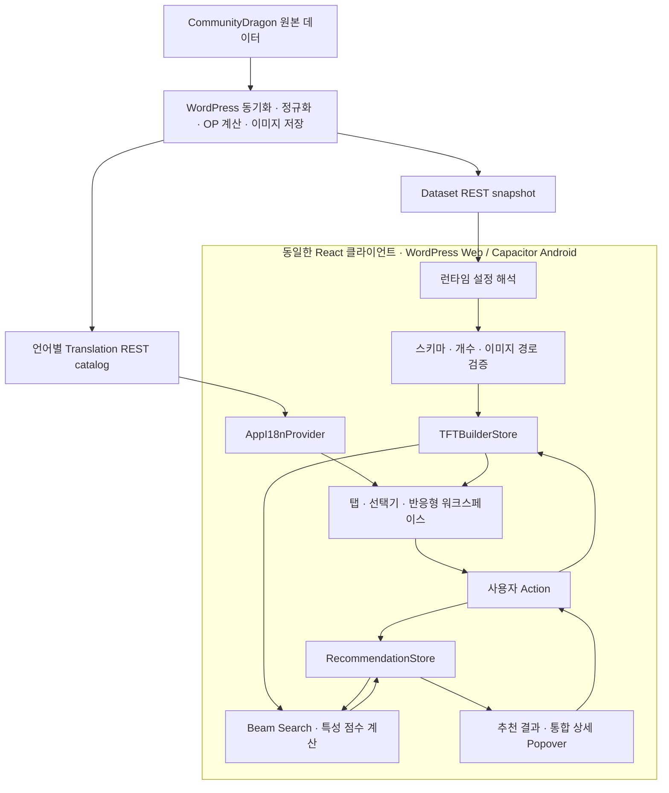
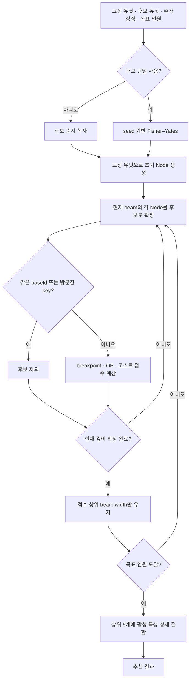
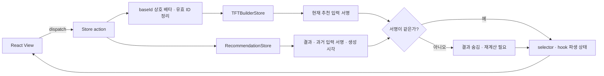
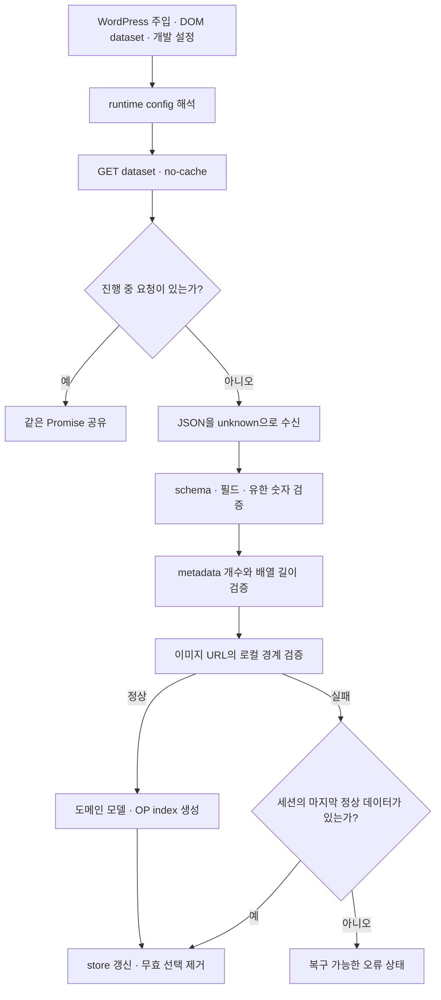
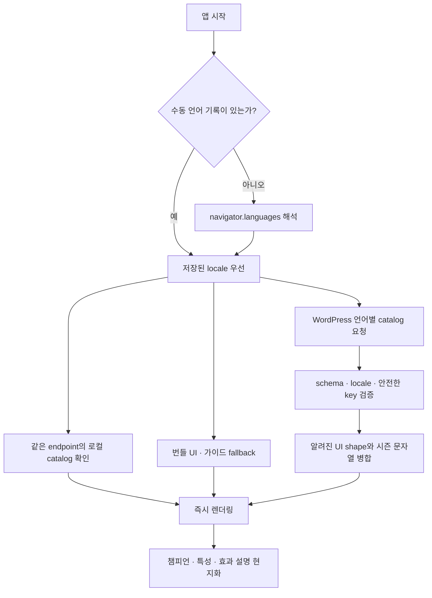
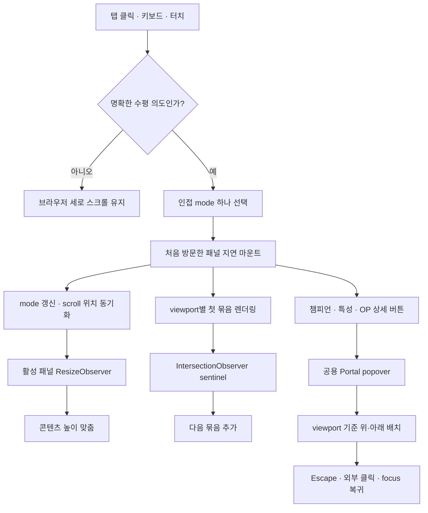

# TFT 팀 조합 추천기 — 프런트엔드 아키텍처와 문제 해결 기록

1인 개발 프로젝트 · 2026.01.05 ~ 진행 중

사용자가 선택한 후보 유닛, 반드시 포함할 고정 유닛, 추가 상징 수량을 바탕으로 특성 breakpoint가 높은 팀을 추천하는 React 애플리케이션입니다. WordPress 플러그인으로 웹에 배포하면서 같은 빌드 결과를 Capacitor Android 앱에서도 사용합니다.

처음에는 “챔피언을 고르고 조합을 계산하는 화면”으로 시작했지만, 실제 서비스로 운영하면서 데이터 신뢰성, 조합 탐색량, 상태 불변식, 시즌별 다국어 데이터, WordPress·모바일 환경의 UI 충돌을 함께 해결해야 했습니다. 아래에는 현재 `features` 구현 전체를 다시 검토한 뒤, 웹 개발 포트폴리오에서 설명할 가치가 가장 높은 다섯 가지 사례만 남겼습니다.

## 전체 구조



| 영역 | 책임 | 대표 코드 |
|---|---|---|
| API 경계 | 런타임 주소 해석, 응답 검증, 요청 병합, 마지막 정상 snapshot 보존 | [`api/tftApi.ts`](./api/tftApi.ts) |
| 계산 코어 | 조합 상태 정규화, Beam Search, breakpoint 점수와 활성 특성 계산 | [`core`](./core) |
| Flux 스타일 상태 | 서버 데이터, 사용자 선택, 화면 모드, 추천 snapshot과 action 관리 | [`store`](./store), [`team-builder/recommendationStore.ts`](./team-builder/recommendationStore.ts) |
| 국제화 | 기기 언어, 수동 선택, 번들 fallback, WordPress 실시간 번역 결합 | [`i18n`](./i18n) |
| 웹 UI | 선택 전략, 점진 렌더링, 탭·캐러셀, Portal 상세 정보, WordPress CSS 격리 | [`selector`](./selector), [`workspace`](./workspace), [`details`](./details) |

## 기술 스택

- React 19, TypeScript, Vite
- Zustand
- Tailwind CSS
- WordPress REST API
- Capacitor Android

## 포트폴리오로 고른 다섯 가지 문제 해결

### 1. 전수조사 대신 Beam Search로 탐색량을 통제했다

| 흐름 | 직접 겪은 내용 |
|---|---|
| 문제 | 후보가 늘어날수록 남은 `d`자리를 `c`명의 후보에서 고르는 경우의 수가 조합적으로 커졌습니다. 화면은 빠르게 결과를 보여줘야 하는데 모든 조합을 끝까지 확인하면 후보 범위를 조금만 넓혀도 응답 시간이 예측하기 어려워졌습니다. |
| 처음 시도 | 당장 점수가 가장 많이 오르는 챔피언을 한 명씩 고르는 그리디 접근을 먼저 생각했습니다. 구현은 단순했지만 TFT 특성은 현재 팀의 누적 인원과 다음 breakpoint에 의해 가치가 달라졌습니다. 지금은 점수가 낮은 선택이 다음 단계에서 큰 시너지를 여는 경우를 너무 일찍 버렸습니다. |
| 결정 | 한 경로만 남기는 대신 깊이마다 상위 `b`개 조합을 유지하는 Beam Search를 적용했습니다. `Node`는 챔피언 ID를 정렬해 순서만 다른 팀을 같은 key로 만들고, `baseId`가 같은 변형 유닛은 확장 전에 제외합니다. 기본 beam width는 28, 결과는 최대 5개입니다. |
| 세부 구현 | 점수는 `활성 breakpoint 합 + 고유 OP baseId × 0.3 + 코스트 합 × 0.01`의 원시값으로 비교합니다. 후보 랜덤 옵션을 켰을 때만 seed 기반 Fisher–Yates로 후보 복사본을 섞고, 고정 유닛은 초기 Node에 그대로 둡니다. 같은 seed는 같은 결과를 재현하며 기본값은 결정적인 순서를 유지합니다. |
| 결과와 한계 | 탐색량을 `O(d × b × c × (P + log(b × c)))` 범위로 제한해 입력 크기에 따른 비용을 설명할 수 있게 됐습니다. 그리디보다 breakpoint 조합을 넓게 보지만 Beam Search도 전역 최적해를 보장하지는 않습니다. 정확도와 브라우저 응답성 사이에서 폭을 명시적으로 조절한 선택입니다. |



관련 코드: [`core/beamSearchOptimizer.ts`](./core/beamSearchOptimizer.ts), [`core/Node.ts`](./core/Node.ts), [`core/traitEvaluator.ts`](./core/traitEvaluator.ts), [`core/candidateOrder.ts`](./core/candidateOrder.ts)

### 2. Flux 스타일 단방향 흐름으로 상태의 의미를 지켰다

| 흐름 | 직접 겪은 내용 |
|---|---|
| 문제 | 후보 유닛과 고정 유닛은 같은 챔피언 목록을 사용하지만 의미는 반대입니다. 같은 원본 유닛이 두 Set에 동시에 들어가면 “고를 수 있는 후보”인지 “반드시 포함할 유닛”인지 계산과 UI가 서로 다르게 해석했습니다. 탭이 언마운트될 때 결과가 사라지는 문제를 막으려고 결과를 전역에 두자, 이번에는 입력이 바뀐 뒤 오래된 결과가 남았습니다. |
| 처음 시도 | 컴포넌트의 local state와 개별 toggle 함수로 각각 처리했습니다. 화면 수가 늘자 같은 불변식을 여러 컴포넌트가 따로 지켜야 했고, 한쪽 수정이 다른 선택 집합과 추천 결과까지 일관되게 갱신한다는 보장이 없었습니다. |
| 결정 | View가 action을 호출하고, Zustand store가 다음 상태를 만들며, selector와 hook이 파생 상태를 View에 돌려주는 Flux 스타일 단방향 흐름으로 정리했습니다. `toggle`, `toggleFixed`, `applyTeamAsFixed`가 같은 `baseId` 계열을 반대 Set에서 한 번에 제거하므로 잘못된 중간 상태를 노출하지 않습니다. |
| 오래된 결과 방지 | 추천 결과는 별도의 `RecommendationSnapshot`으로 보관하되 계산 당시의 후보·고정·상징·팀 크기·랜덤 설정·특성 규칙·OP 버전·점수 가중치를 직렬화한 서명을 함께 저장합니다. 현재 입력 서명과 다르면 결과를 즉시 숨기고 재계산 필요 상태로 바꿉니다. |
| 결과 | UI는 store의 Set과 Map을 직접 변형하지 않고 action이라는 한 통로만 사용합니다. 탭 이동에는 결과가 유지되지만 실제 계산 입력이 바뀌면 과거 결과를 최신 결과처럼 보여주지 않습니다. 후보/고정 화면의 차이는 전략 객체로 모아 컴포넌트 분기까지 줄였습니다. |



관련 코드: [`store/useTFTBuilderStore.ts`](./store/useTFTBuilderStore.ts), [`team-builder/recommendationStore.ts`](./team-builder/recommendationStore.ts), [`team-builder/recommendationSignature.ts`](./team-builder/recommendationSignature.ts), [`selector/champion-selector/selectorStrategies.ts`](./selector/champion-selector/selectorStrategies.ts)

### 3. WordPress REST 응답을 신뢰 경계에서 검증했다

| 흐름 | 직접 겪은 내용 |
|---|---|
| 문제 | 웹과 Android가 같은 프런트엔드를 쓰지만 데이터 주소를 얻는 방식은 달랐습니다. WordPress는 DOM과 인라인 설정을 주입하고, 개발 서버와 Capacitor는 별도 런타임 주소가 필요했습니다. 더 큰 문제는 HTTP 200만 확인하면 필드 누락, 이전 schema, 잘못된 개수, 외부 이미지 URL까지 정상 데이터로 들어올 수 있다는 점이었습니다. |
| 처음 시도 | REST 응답을 TypeScript 타입으로 단언해 바로 store에 넣었습니다. TypeScript 타입은 빌드 시점에만 존재하므로 서버 JSON의 실제 형태를 보장하지 못했고, 중복 마운트에서 같은 요청이 겹치거나 일시적인 네트워크 오류로 이미 보던 정상 화면이 사라졌습니다. |
| 결정 | 응답을 `unknown`으로 받은 뒤 champion, trait, OP, metadata를 런타임 type guard로 검증합니다. schema version과 metadata 개수가 실제 배열 길이와 같은지 확인하고, 이미지 URL은 WordPress가 제공한 로컬 asset base 아래에 있을 때만 허용합니다. |
| 복구 전략 | 동시에 들어온 호출은 하나의 in-flight Promise를 공유합니다. 새 요청이 실패하면 현재 세션의 마지막 정상 snapshot을 유지하고, 실패한 Promise 자체는 캐시에서 제거해 다음 호출이 다시 시도할 수 있게 했습니다. 앱이 처음 열릴 때와 focus·online·visibility 복귀 때 15초 중복 방지 창을 두고 재검증합니다. |
| 결과 | 원본 데이터 공급자를 브라우저가 직접 호출하지 않고 WordPress의 정규화된 snapshot만 소비합니다. 시즌 교체로 ID가 사라지면 store가 후보·고정·상징에서 유효하지 않은 항목을 함께 정리합니다. 웹과 앱의 주소 주입 방식은 달라도 이후 검증과 상태 반영 경로는 하나입니다. |



관련 코드: [`api/tftApi.ts`](./api/tftApi.ts), [`workspace/hooks/useRuntimeDataRefresh.ts`](./workspace/hooks/useRuntimeDataRefresh.ts), [`store/useTFTBuilderStore.ts`](./store/useTFTBuilderStore.ts)

### 4. 고정 UI 번역과 시즌 데이터를 분리해 다국어를 운영했다

| 흐름 | 직접 겪은 내용 |
|---|---|
| 문제 | 한국어, 영어, 일본어, 중국어 간체·번체를 지원하면서 앱 UI 문구와 매 시즌 바뀌는 챔피언·특성·설명을 같은 번들에 넣었습니다. 새로운 세트가 나올 때마다 앱을 다시 빌드해야 했고, 오래된 시즌 문자열이 첫 설치 번들에 계속 쌓였습니다. |
| 처음 시도 | 언어별 객체를 프런트엔드에 모두 포함하고 선택 언어를 localStorage에 저장했습니다. 오프라인에는 강했지만 WordPress 동기화와 앱 데이터가 서로 다른 시점을 가리킬 수 있었고, 저장소 접근이 차단된 브라우저에서는 초기 언어 선택까지 흔들렸습니다. |
| 결정 | 오래 변하지 않는 UI·가이드 문구는 번들 fallback으로 두고, 챔피언명·특성명·특성 설명은 WordPress의 언어별 runtime catalog에서 받습니다. catalog는 schema와 요청 locale을 확인한 뒤 알려진 UI 구조만 fallback 위에 병합하고, 문자열 Map은 `__proto__`, `constructor`, `prototype` key를 거부합니다. |
| 언어 선택 | 수동 선택 이력이 있으면 그 값을 우선하고, 없으면 `navigator.languages` 순서로 기기 언어를 해석합니다. `zh-Hant`, `zh-TW`, `zh-HK`, `zh-MO`는 번체로, 나머지 중국어는 간체로 분기합니다. 저장소가 막혀도 현재 세션의 언어 변경과 기기 언어 fallback은 계속 작동합니다. |
| 결과 | 앱은 번들만으로도 기본 UI를 그릴 수 있고, 연결되면 최신 시즌 번역으로 자연스럽게 교체됩니다. catalog cache에는 endpoint를 함께 저장해 다른 WordPress 서버의 번역과 섞이지 않게 했고, 동일 locale 요청을 병합하며 focus·online 복귀 때 최신 catalog를 확인합니다. |



관련 코드: [`i18n/AppI18n.tsx`](./i18n/AppI18n.tsx), [`i18n/useAppI18n.ts`](./i18n/useAppI18n.ts), [`i18n/deviceLocale.ts`](./i18n/deviceLocale.ts), [`i18n/translationApi.ts`](./i18n/translationApi.ts), [`i18n/translationCatalog.ts`](./i18n/translationCatalog.ts)

### 5. WordPress 안에서도 모바일 앱처럼 안정적인 작업 화면을 만들었다

| 흐름 | 직접 겪은 내용 |
|---|---|
| 문제 | WordPress와 Elementor의 전역 button 스타일이 앱 버튼까지 덮어썼고, 챔피언 목록을 한 번에 렌더링하면 모바일 첫 화면 비용이 커졌습니다. 탭과 가로 패널을 연결한 뒤에는 세로 스크롤이 대각선으로 움직일 때 의도하지 않은 탭 전환이 생기고, 상세 팝오버가 작은 화면 밖으로 잘렸습니다. |
| 처음 시도 | CSS scroll-snap과 브라우저의 가로 관성에 맡기고 모든 패널과 카드를 처음부터 마운트했습니다. 구현은 짧았지만 빠른 스와이프가 여러 패널을 건너뛰었고, 부드러운 스크롤 중 지나가는 패널이 현재 mode를 덮어썼습니다. WordPress의 `:hover`, `:focus`, `:active` 규칙도 앱 상태 표현과 충돌했습니다. |
| 결정 | 터치 종료 시 가로 이동 48px 이상이며 세로 이동의 1.4배를 넘을 때만 수평 의도로 인정하고 항상 인접 패널 하나만 이동시킵니다. 프로그램 이동 중에는 mode 동기화를 잠그고, ResizeObserver로 폭이 바뀌면 현재 패널에 다시 정렬합니다. 방문한 패널만 지연 마운트하고 비활성 패널은 `content-visibility`와 `inert`로 렌더링·상호작용에서 제외합니다. |
| 목록과 상세 정보 | 챔피언은 viewport별 8·12·18개, 특성은 6·10·14개부터 렌더링하고 IntersectionObserver가 sentinel에 접근할 때 다음 묶음을 추가합니다. 상세 정보는 하나의 외부 store와 Portal을 공유해 한 번에 하나만 열며, viewport 공간에 따라 위·아래 위치를 계산하고 Escape, 외부 클릭, 닫기 후 focus 복귀를 처리합니다. |
| 결과 | 같은 React 화면을 WordPress 문서 흐름과 Android WebView에서 함께 사용할 수 있게 됐습니다. 탭은 ARIA tab 계약과 방향키·Home·End 이동을 제공하고, reduced motion과 좁은 화면에서는 즉시 이동합니다. CSS 격리는 workspace root 아래의 상태별 규칙만 높은 명시도로 복원해 호스트 테마 영향을 제한합니다. |



관련 코드: [`workspace/hooks/useWorkspaceCarousel.ts`](./workspace/hooks/useWorkspaceCarousel.ts), [`workspace/carouselNavigation.ts`](./workspace/carouselNavigation.ts), [`selector/hooks/useProgressiveRenderCount.ts`](./selector/hooks/useProgressiveRenderCount.ts), [`details/DetailPopover.tsx`](./details/DetailPopover.tsx), [`styles/wordpressButtonIsolation.css`](./styles/wordpressButtonIsolation.css)

## 검증 방법

```bash
npm run test:core
npm run lint
npm run build
```

핵심 테스트는 조합 순서와 OP 점수, runtime schema·이미지 경계, 마지막 정상 snapshot 복구, baseId 상호 배타, 추천 서명 무효화, 다국어 catalog 병합, 기기 언어 판정, 모바일 제스처, 점진 렌더링, WordPress 스타일 격리를 확인합니다. 프로덕션 빌드는 같은 `dist`가 WordPress 플러그인과 Capacitor Android 동기화의 입력으로 사용될 수 있는지도 함께 검증합니다.
