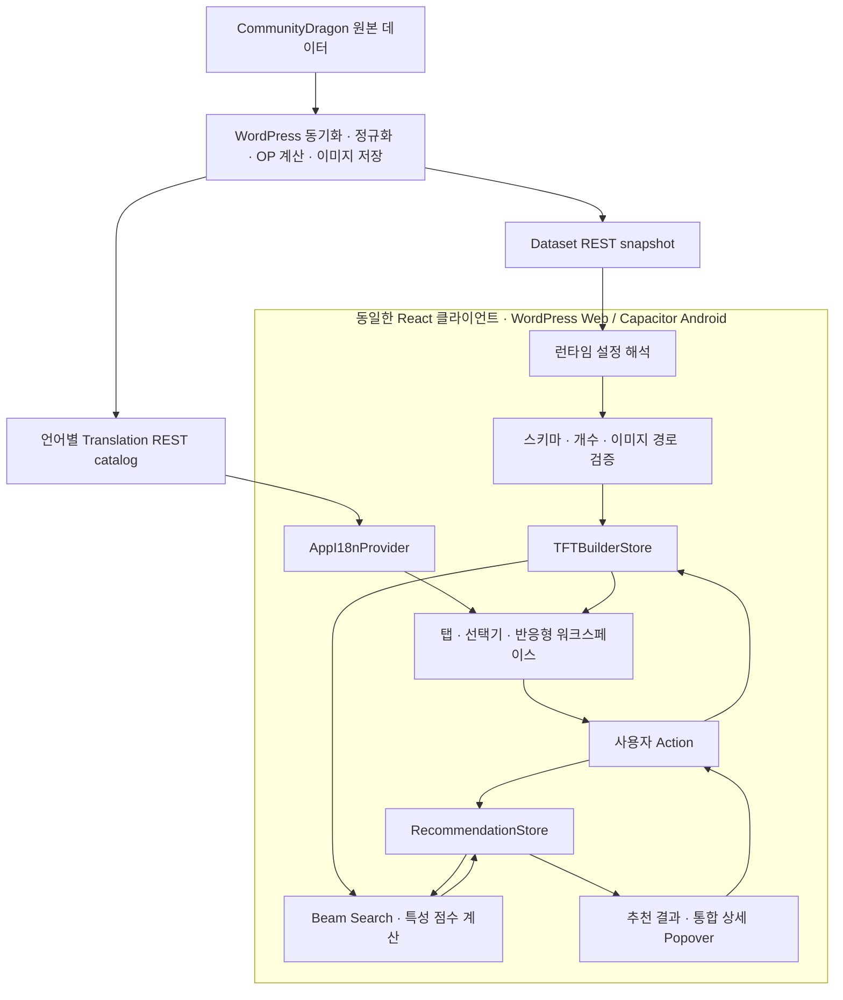
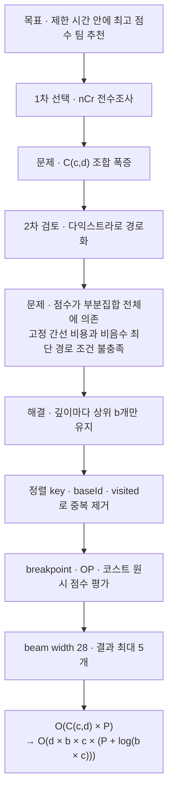
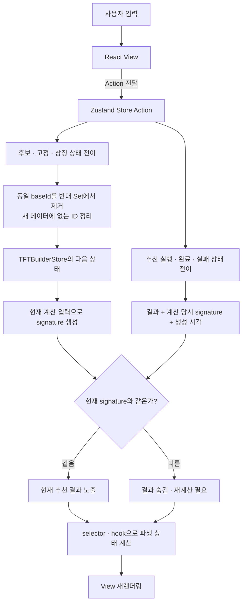
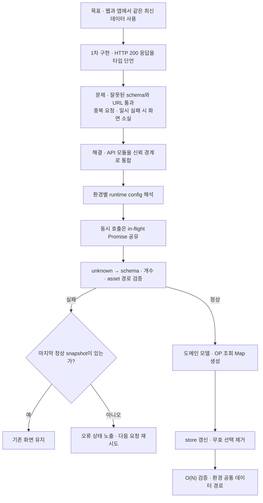
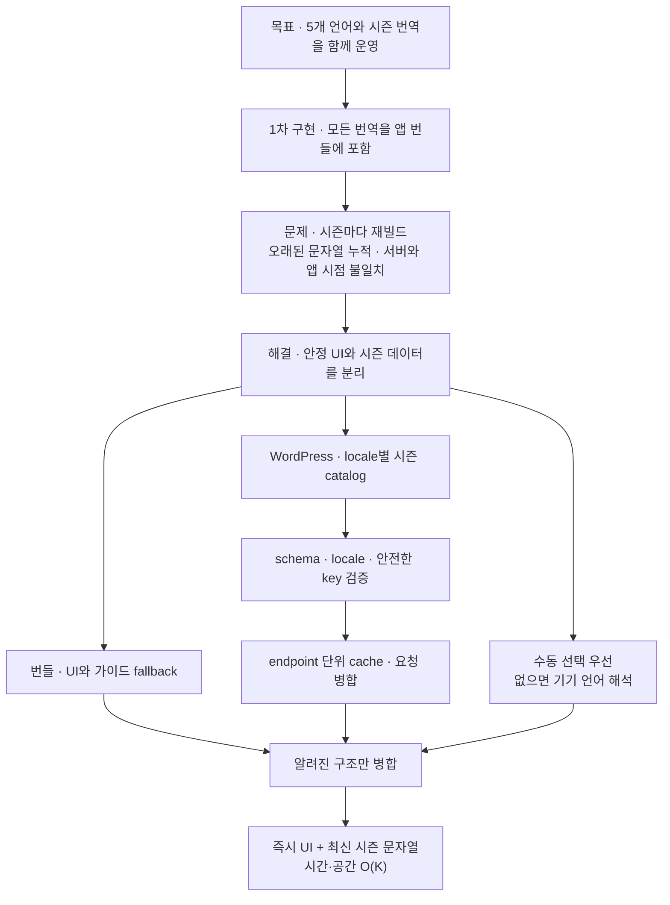
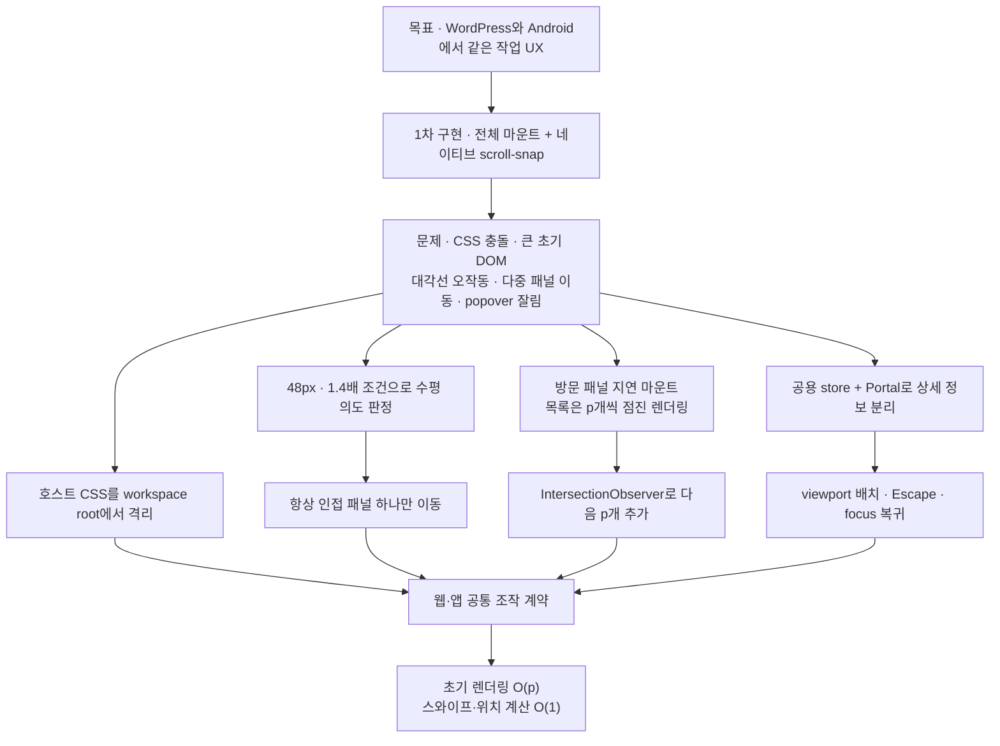

# TFT 팀 조합 추천기 — 프런트엔드 아키텍처와 문제 해결 기록

1인 개발 프로젝트 · 2026.01.05 ~ 진행 중

사용자가 선택한 후보 유닛, 반드시 포함할 고정 유닛, 추가 상징 수량을 바탕으로 특성 breakpoint가 높은 팀을 추천하는 React 애플리케이션입니다. WordPress 플러그인으로 웹에 배포하면서 같은 빌드 결과를 Capacitor Android 앱에서도 사용합니다.

처음에는 “챔피언을 고르고 조합을 계산하는 화면”으로 시작했지만, 실제 서비스로 운영하면서 데이터 신뢰성, 조합 탐색량, 상태 불변식, 시즌별 다국어 데이터, WordPress·모바일 환경의 UI 충돌을 함께 해결해야 했습니다. 아래에는 현재 `features` 구현 전체를 다시 검토한 뒤, 웹 개발 포트폴리오에서 설명할 가치가 가장 높은 다섯 가지 사례만 남겼습니다.

## 전체 구조



| 영역 | 책임 | 대표 코드 |
|---|---|---|
| API 경계 | 런타임 주소 해석, 응답 검증, 요청 병합, 마지막 정상 snapshot 보존 | [`api/tftApi.ts`](./api/tftApi.ts) |
| 계산 코어 | 조합 상태 정규화, Beam Search, breakpoint 점수와 활성 특성 계산 | [`core`](./core) |
| Flux 스타일 상태 | 서버 데이터, 사용자 선택, 화면 모드, 추천 snapshot과 action 관리 | [`store`](./store), [`team-builder/recommendationStore.ts`](./team-builder/recommendationStore.ts) |
| 국제화 | 기기 언어, 수동 선택, 번들 fallback, WordPress 실시간 번역 결합 | [`i18n`](./i18n) |
| 웹 UI | 선택 전략, 점진 렌더링, 탭·캐러셀, Portal 상세 정보, WordPress CSS 격리 | [`selector`](./selector), [`workspace`](./workspace), [`details`](./details) |

## 기술 스택

- React 19, TypeScript, Vite
- Zustand
- Tailwind CSS
- WordPress REST API
- Capacitor Android

## 포트폴리오로 고른 다섯 가지 문제 해결

각 사례는 실제 구현 당시의 판단이 어떻게 바뀌었는지 `구현 목표 → 단순 접근 → 문제 발생 → 원인 분석 → 해결 → 결과` 순서로 정리했습니다.

### 1. 전수조사 대신 Beam Search로 탐색량을 통제했다

| 흐름 | 직접 겪은 내용 |
|---|---|
| 구현 목표 | 고정 유닛을 반드시 포함하면서 후보 `c`명 중 남은 `d`명을 골라, 특성 breakpoint 점수가 높은 팀을 브라우저에서 바로 추천하려고 했습니다. |
| 처음 선택한 단순 접근 | 가장 정확한 방법은 가능한 조합을 `nCr`로 모두 만들고 점수를 비교하는 전수조사라고 생각했습니다. 이어서 챔피언 선택 과정을 그래프의 경로 문제로 바꾸면 다익스트라를 재사용할 수 있을지도 검토했습니다. |
| 문제 발생 | 전수조사는 조합 생성만 `C(c, d)`개입니다. 예를 들어 후보 50명 중 8명을 고르면 536,878,650개라서 각 팀의 특성까지 계산하기 전에 이미 브라우저에서 감당하기 어렵습니다. 다익스트라는 간선 비용이 고정되고 누적 가능한 최단 경로에 맞지만, 이 프로젝트는 팀 전체 점수를 최대화해야 하며 같은 챔피언도 현재 팀이 어떤 breakpoint 직전인지에 따라 증가 점수가 달라졌습니다. |
| 원인 분석 | 조합 점수는 챔피언 두 명 사이의 고정 비용이 아니라 현재 부분집합 전체에 의존합니다. 팀 부분집합을 각각 그래프 정점으로 만들면 결국 `nCr`과 비슷한 수의 상태가 다시 생기고, 최대 점수를 음수 비용으로 바꾸면 다익스트라의 비음수 간선 조건에도 맞지 않습니다. 즉, 문제를 그래프로 옮기는 것만으로 탐색량이 줄지 않았습니다. |
| 해결 | 각 깊이에서 모든 경로를 남기지 않고 점수 상위 `b`개만 다음 단계로 보내는 Beam Search를 선택했습니다. 정렬된 ID로 순서만 다른 조합을 같은 key로 만들고, 같은 `baseId` 변형과 이미 방문한 조합을 확장 전에 제거했습니다. 기본 `b`는 28, 반환 결과는 최대 5개이며 후보 랜덤 옵션을 켰을 때만 seed 기반 Fisher–Yates를 적용합니다. |
| 결과 | 팀 하나의 생성·평가 비용을 `P`, 팀 크기를 `t`라 할 때 전수조사의 `O(C(c,d) × P)`를 `O(d × b × c × (P + log(b × c)))`로 제한했습니다. 방문 key까지 포함한 공간은 `O(d × b × c × t)`입니다. 전수조사처럼 전역 최적해를 보장하지는 않지만, 정확도 일부를 감수하는 대신 탐색 폭과 브라우저 계산량을 수치로 통제할 수 있게 됐습니다. |



관련 코드: [`core/beamSearchOptimizer.ts`](./core/beamSearchOptimizer.ts), [`core/Node.ts`](./core/Node.ts), [`core/traitEvaluator.ts`](./core/traitEvaluator.ts), [`core/candidateOrder.ts`](./core/candidateOrder.ts)

### 2. Flux 스타일 단방향 흐름으로 상태의 의미를 지켰다

| 흐름 | 직접 겪은 내용 |
|---|---|
| 구현 목표 | 후보, 고정 유닛, 추가 상징과 추천 결과를 여러 탭에서 공유하되 어떤 화면에서 수정해도 같은 의미의 상태를 보게 만들려고 했습니다. |
| 처음 선택한 단순 접근 | 각 화면이 필요한 값을 local state로 가지고 후보용 `toggle`과 고정용 `toggle`을 따로 호출하게 했습니다. 추천 결과도 처음에는 결과 화면의 수명에 맞춰 보관했습니다. |
| 문제 발생 | 같은 `baseId`의 유닛이 후보와 고정 Set에 동시에 남아 계산 의미가 충돌했고, 탭이 언마운트되면 결과가 사라졌습니다. 결과를 전역으로 옮긴 뒤에는 반대로 후보나 특성 규칙이 바뀌어도 이전 결과가 남아 최신 계산처럼 보였습니다. 화면마다 상태 정리 분기를 추가할수록 동일한 규칙이 여러 파일로 퍼졌습니다. |
| 원인 분석 | View가 상태 변경 규칙까지 소유해 하나의 사용자 입력이 반대 Set, 추천 결과, 화면 mode에 미치는 영향을 원자적으로 처리하지 못했습니다. 또한 “결과 배열”만 저장해서 그 결과를 만든 입력과 현재 입력이 같은지 판별할 근거가 없었습니다. |
| 해결 | View는 action만 전달하고 Zustand store가 다음 상태를 만드는 Flux 스타일 단방향 흐름으로 바꿨습니다. `toggle`, `toggleFixed`, `applyTeamAsFixed` 안에서 반대 Set의 동일 `baseId`를 함께 제거합니다. 추천 결과에는 계산 당시의 모든 입력을 직렬화한 signature를 저장하고 현재 signature와 다르면 결과를 숨긴 뒤 재계산 상태로 전환합니다. 후보/고정 UI 차이는 전략 객체 한 곳에 모았습니다. |
| 결과 | `Set.has` 기반 선택 조회는 평균 `O(1)`, 불변 Set·Map 갱신은 선택 수 `k`에 대해 `O(k)`입니다. 추천 signature는 전체 챔피언 `n`명에서 포함된 `m`명을 찾고 특성 `q`개를 정렬하므로 `O(n + m log m + q log q)` 범위에서 계산됩니다. 탭 이동에는 결과가 유지되면서 실제 계산 입력이 달라진 순간에만 무효화됩니다. |



관련 코드: [`store/useTFTBuilderStore.ts`](./store/useTFTBuilderStore.ts), [`team-builder/recommendationStore.ts`](./team-builder/recommendationStore.ts), [`team-builder/recommendationSignature.ts`](./team-builder/recommendationSignature.ts), [`selector/champion-selector/selectorStrategies.ts`](./selector/champion-selector/selectorStrategies.ts)

### 3. WordPress REST 응답을 신뢰 경계에서 검증했다

| 흐름 | 직접 겪은 내용 |
|---|---|
| 구현 목표 | WordPress 웹과 Capacitor Android가 같은 React 코드를 사용하면서도 각 환경에서 최신 TFT snapshot을 안전하게 불러오게 하려고 했습니다. |
| 처음 선택한 단순 접근 | REST 요청이 HTTP 200이면 응답을 TypeScript 타입으로 단언해 바로 store에 넣었습니다. WordPress, 개발 서버, 앱의 주소 차이는 호출하는 쪽에서 각각 처리하면 된다고 생각했습니다. |
| 문제 발생 | 실행 중 받은 JSON에는 TypeScript 타입이 적용되지 않아 필드 누락, 이전 schema, metadata 개수 불일치도 통과할 수 있었습니다. 잘못된 외부 이미지 URL도 그대로 렌더링됐고, 여러 컴포넌트가 동시에 마운트되면 같은 요청이 중복됐습니다. 일시적인 통신 실패 한 번으로 이미 사용 중이던 정상 데이터까지 사라지는 문제도 생겼습니다. |
| 원인 분석 | 네트워크 응답은 애플리케이션 밖에서 들어오는 `unknown` 데이터인데 컴파일 시점 타입을 런타임 검증처럼 사용한 것이 원인이었습니다. 환경별 URL 해석, payload 검증, 중복 요청, 실패 복구가 서로 다른 호출부에 흩어져 신뢰 경계도 명확하지 않았습니다. |
| 해결 | 런타임 설정을 한곳에서 해석하고 응답을 `unknown`으로 받은 뒤 champion, trait, OP, metadata를 type guard로 검증했습니다. schema version, 실제 배열 길이, 로컬 asset base까지 확인한 데이터만 도메인 모델로 바꿉니다. 동시 호출은 하나의 in-flight Promise를 공유하고, 실패하면 세션의 마지막 정상 snapshot을 사용하며 다음 focus·online·visibility 복귀 때 재시도합니다. |
| 결과 | payload 전체 요소 수를 `N`이라 할 때 검증은 `O(N)`, 정규화된 데이터와 조회 Map은 `O(N)` 공간에서 처리됩니다. 겹친 호출 수와 무관하게 실제 진행 중인 네트워크 요청은 1개로 합쳐졌고, 시즌 변경으로 사라진 ID도 store 반영 시 함께 제거됩니다. 웹과 앱은 주소만 다르게 주입하고 이후 검증 경로는 공유합니다. |



관련 코드: [`api/tftApi.ts`](./api/tftApi.ts), [`workspace/hooks/useRuntimeDataRefresh.ts`](./workspace/hooks/useRuntimeDataRefresh.ts), [`store/useTFTBuilderStore.ts`](./store/useTFTBuilderStore.ts)

### 4. 고정 UI 번역과 시즌 데이터를 분리해 다국어를 운영했다

| 흐름 | 직접 겪은 내용 |
|---|---|
| 구현 목표 | 한국어, 영어, 일본어, 중국어 간체·번체를 지원하면서 새 시즌의 챔피언명, 특성명, 특성 설명을 앱 재배포 없이 갱신하려고 했습니다. |
| 처음 선택한 단순 접근 | UI 문구와 시즌 데이터를 언어별 객체에 모두 넣고 앱 번들에 포함했습니다. 사용자가 고른 언어는 localStorage에 저장해 다음 실행에서도 복원했습니다. |
| 문제 발생 | 세트가 바뀔 때마다 번역 데이터 때문에 웹과 앱을 다시 빌드해야 했고, 지난 시즌 문자열이 번들에 계속 남았습니다. WordPress는 이미 새 데이터를 동기화했는데 설치된 앱은 이전 번역을 보여줄 수 있었으며, 저장소 접근이 차단되면 언어 초기화도 안정적이지 않았습니다. |
| 원인 분석 | 거의 바뀌지 않는 UI 문구와 매 시즌 바뀌는 게임 데이터를 같은 배포 주기에 묶은 것이 문제였습니다. 또한 저장된 수동 선택, 기기 언어, 원격 번역, 오프라인 fallback의 우선순위가 하나의 흐름으로 정의되지 않았습니다. |
| 해결 | UI·가이드는 번들 fallback으로 남기고 시즌 문자열은 WordPress의 locale별 runtime catalog로 분리했습니다. 수동 선택이 있으면 우선하고, 없으면 `navigator.languages`를 해석합니다. catalog의 schema와 locale을 확인한 뒤 알려진 구조만 병합하고 위험한 prototype key를 거부합니다. 요청은 locale·endpoint별로 병합하고 cache도 endpoint와 함께 저장합니다. |
| 결과 | 안정적인 UI는 네트워크 없이 즉시 표시되고 시즌 문자열만 서버 갱신을 따라갑니다. catalog의 문자열 수를 `K`라 하면 검증·병합 시간과 cache 공간은 `O(K)`입니다. 같은 locale의 중복 요청은 1개로 합쳐지며, 저장소를 사용할 수 없어도 현재 세션과 기기 언어 fallback은 유지됩니다. |



관련 코드: [`i18n/AppI18n.tsx`](./i18n/AppI18n.tsx), [`i18n/useAppI18n.ts`](./i18n/useAppI18n.ts), [`i18n/deviceLocale.ts`](./i18n/deviceLocale.ts), [`i18n/translationApi.ts`](./i18n/translationApi.ts), [`i18n/translationCatalog.ts`](./i18n/translationCatalog.ts)

### 5. WordPress 안에서도 모바일 앱처럼 안정적인 작업 화면을 만들었다

| 흐름 | 직접 겪은 내용 |
|---|---|
| 구현 목표 | 같은 React 작업 화면을 Elementor가 있는 WordPress 페이지와 Android WebView에서 모두 사용하면서 모바일의 스크롤·렌더링·상세 정보 조작을 안정적으로 만들려고 했습니다. |
| 처음 선택한 단순 접근 | CSS scroll-snap과 브라우저의 가로 관성에 탭 이동을 맡기고, 모든 패널과 챔피언 카드를 처음부터 마운트했습니다. 상세 정보는 각 카드 가까이에 배치하고 일반적인 컴포넌트 CSS만 적용했습니다. |
| 문제 발생 | Elementor의 전역 button 상태가 앱 버튼을 덮어썼고, 긴 목록의 초기 DOM이 모바일 렌더링 비용을 키웠습니다. 대각선 세로 스크롤이 가로 이동으로 오인되거나 한 번의 빠른 스와이프가 여러 패널을 건너뛰었습니다. 카드 안의 팝오버는 overflow와 작은 viewport에 잘렸고 탭 이동 때 상태가 사라졌습니다. |
| 원인 분석 | 호스트 문서의 CSS와 overflow 안에서 앱 UI가 독립적일 것이라고 가정했고, “목록 데이터 수”와 “지금 그려야 할 DOM 수”를 구분하지 않았습니다. 네이티브 관성만으로는 사용자의 수평 의도와 현재 mode를 일관되게 제어할 수 없었습니다. |
| 해결 | workspace root 아래에서 WordPress 상태 스타일을 격리하고, 방문한 패널만 지연 마운트했습니다. 가로 이동이 48px 이상이면서 세로 이동의 1.4배를 넘을 때만 인접 패널 하나로 이동합니다. 목록은 viewport별 page size만 먼저 그리고 IntersectionObserver로 추가합니다. 상세 정보는 공용 store와 Portal로 분리해 viewport 기준 위치, Escape, 외부 클릭, focus 복귀를 한곳에서 처리했습니다. |
| 결과 | 전체 목록이 `n`개여도 초기 카드 DOM은 page size `p`개라 초기 렌더링이 `O(n)`에서 `O(p)`로 제한되고, 다음 묶음도 한 번에 `O(p)`씩 추가됩니다. 스와이프 판정과 팝오버 위치 계산은 `O(1)`입니다. ARIA tab, 방향키·Home·End, `inert`, reduced motion까지 같은 흐름에 포함해 웹과 앱의 조작 계약을 맞췄습니다. |



관련 코드: [`workspace/hooks/useWorkspaceCarousel.ts`](./workspace/hooks/useWorkspaceCarousel.ts), [`workspace/carouselNavigation.ts`](./workspace/carouselNavigation.ts), [`selector/hooks/useProgressiveRenderCount.ts`](./selector/hooks/useProgressiveRenderCount.ts), [`details/DetailPopover.tsx`](./details/DetailPopover.tsx), [`styles/wordpressButtonIsolation.css`](./styles/wordpressButtonIsolation.css)

## 검증 방법

```bash
npm run test:core
npm run lint
npm run build
```

핵심 테스트는 조합 순서와 OP 점수, runtime schema·이미지 경계, 마지막 정상 snapshot 복구, baseId 상호 배타, 추천 서명 무효화, 다국어 catalog 병합, 기기 언어 판정, 모바일 제스처, 점진 렌더링, WordPress 스타일 격리를 확인합니다. 프로덕션 빌드는 같은 `dist`가 WordPress 플러그인과 Capacitor Android 동기화의 입력으로 사용될 수 있는지도 함께 검증합니다.
