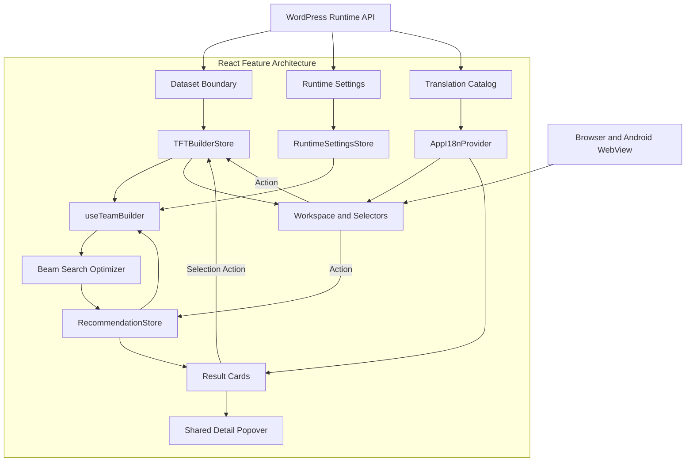
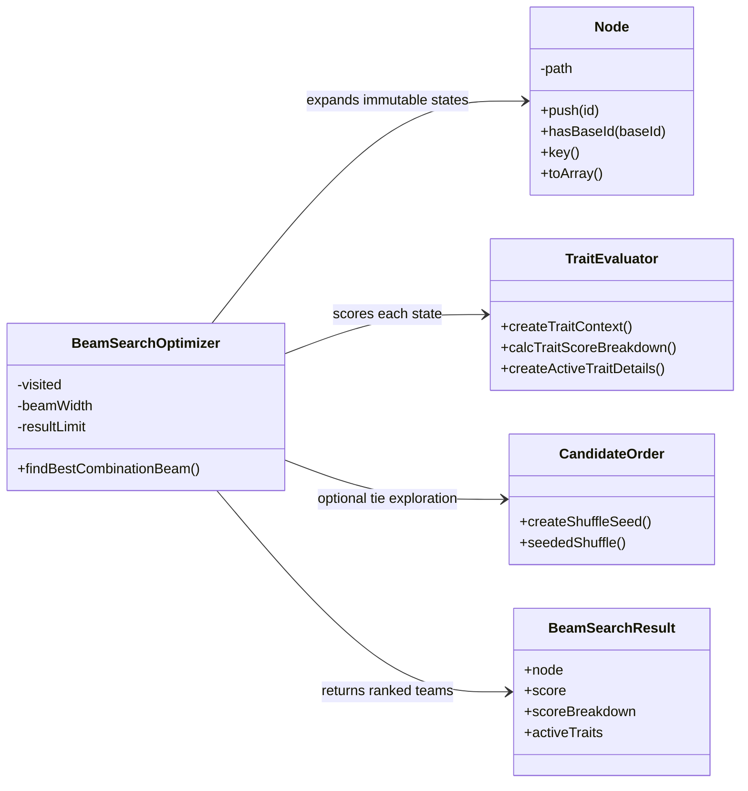
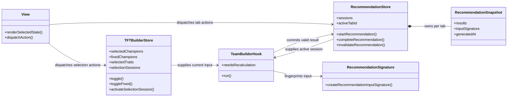
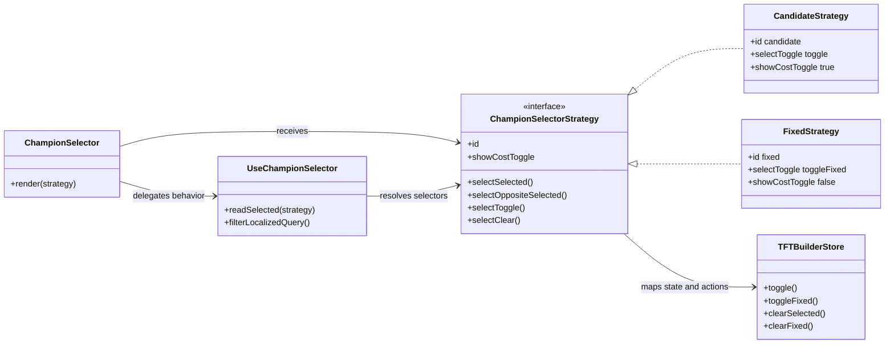
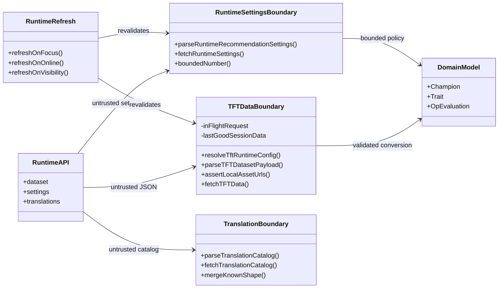
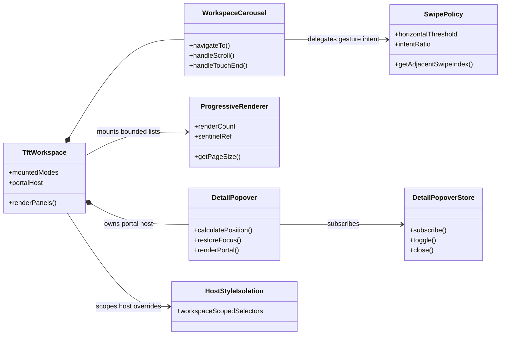

# TFT 팀 조합 추천기 — 프런트엔드 아키텍처 포트폴리오

1인 개발 프로젝트 · 2026.01.05 ~ 진행 중

사용자가 선택한 후보 유닛, 반드시 포함할 고정 유닛, 추가 상징을 조합해 높은 특성 점수를 만드는 팀을 추천하는 React 애플리케이션입니다. 같은 프런트엔드 빌드를 WordPress 웹과 Capacitor Android에서 사용하며, 시즌 데이터와 운영 설정은 런타임에 갱신합니다.

처음에는 챔피언을 고르고 계산 버튼을 누르면 끝나는 화면이라고 생각했습니다. 후보가 적고 화면이 하나일 때는 실제로 그렇게 동작했습니다. 하지만 후보 수를 늘리자 계산 시간이 눈에 띄게 길어졌고, 탭을 오가며 선택을 바꾸면 서로 다른 화면의 상태가 어긋나기 시작했습니다. 개발 서버에서 멀쩡하던 버튼과 스크롤은 WordPress에 올리자 달라졌고, 같은 React 빌드를 사용하는 Android 앱이 서버와 다른 시즌 데이터를 보여 주는 경우도 생겼습니다.

그때부터 기능을 더 붙이는 것보다, 문제가 생긴 경계를 하나씩 다시 정하는 데 더 많은 시간을 썼습니다. 이 문서는 `src/features`의 현재 구현만을 대상으로 하며, 알고리즘·상태 흐름·디자인 패턴·운영 안정성·웹 플랫폼 설계를 다섯 가지 사례로 정리합니다.

## 전체 구조


```mermaid
flowchart TB
    Runtime["WordPress Runtime API"] --> Dataset["Dataset Boundary"]
    Runtime --> Settings["Runtime Settings"]
    Runtime --> Translations["Translation Catalog"]

    subgraph Client["React Feature Architecture"]
        Dataset --> BuilderStore["TFTBuilderStore"]
        Settings --> SettingsStore["RuntimeSettingsStore"]
        Translations --> I18n["AppI18nProvider"]

        Workspace["Workspace and Selectors"] -->|Action| BuilderStore
        Workspace -->|Action| RecommendationStore["RecommendationStore"]
        BuilderStore --> TeamBuilder["useTeamBuilder"]
        SettingsStore --> TeamBuilder
        RecommendationStore --> TeamBuilder
        TeamBuilder --> Optimizer["Beam Search Optimizer"]
        Optimizer --> RecommendationStore
        RecommendationStore --> Result["Result Cards"]
        BuilderStore --> Workspace
        I18n --> Workspace
        I18n --> Result
        Result -->|Selection Action| BuilderStore
        Result --> Details["Shared Detail Popover"]
    end

    Browser["Browser and Android WebView"] --> Workspace
```

| 영역 | 책임 | 대표 코드 |
|---|---|---|
| 런타임 경계 | 환경별 endpoint 해석, 외부 JSON 검증, 요청 병합, 마지막 정상 snapshot 보존 | [`api/tftApi.ts`](./api/tftApi.ts), [`config/runtimeSettings.ts`](./config/runtimeSettings.ts) |
| 도메인·알고리즘 | 챔피언 모델, 특성 breakpoint 평가, Beam Search | [`domain`](./domain), [`core`](./core) |
| Flux 스타일 상태 | 서버 데이터, 하위 탭별 선택, 추천 snapshot과 action 관리 | [`store`](./store), [`team-builder/recommendationStore.ts`](./team-builder/recommendationStore.ts) |
| 표현 계층 | 선택 전략, 다국어, 반응형 workspace, Portal 상세 정보 | [`selector`](./selector), [`i18n`](./i18n), [`workspace`](./workspace), [`details`](./details) |

## 기술 스택

- React 19, TypeScript, Vite
- Zustand 기반 Flux 스타일 상태 관리
- Tailwind CSS와 범위가 제한된 WordPress 호스트 격리 CSS
- WordPress REST API 런타임 데이터
- Capacitor Android WebView

## 포트폴리오 핵심 설계 5가지

각 사례는 성공한 최종 구조부터 설명하기보다 `처음 선택한 방식 → 실제로 마주친 증상 → 원인을 확인한 과정 → 바꾼 구조 → 결과와 남은 선택`이 자연스럽게 이어지도록 정리했습니다.

### 1. 알고리즘 — 조합 폭발을 Beam Search로 제한했다

처음에는 고정 유닛을 먼저 넣고 후보 `c`명 중 남은 `d`명을 전부 조합한 뒤, 가장 높은 점수의 팀을 고르면 된다고 생각했습니다. 후보가 적을 때는 결과도 정확했고 속도도 문제없었습니다. 그런데 후보를 하나씩 늘려 직접 계산해 보니 어느 순간부터 버튼을 누른 뒤 기다리는 시간이 빠르게 길어졌습니다. 후보 50명 중 8명을 고르는 경우를 계산해 보니 가능한 조합만 536,878,650개였습니다. 팀 점수를 더 빠르게 계산하기 전에, 그 계산 자체를 몇 번 반복할 것인지부터 줄여야 했습니다.

정확한 답을 포기하지 않고 탐색량을 줄일 방법을 찾다가 다익스트라도 검토했습니다. 챔피언을 하나씩 선택하는 과정을 경로로 보면 재사용할 수 있을 것 같았습니다. 하지만 실제 특성 점수를 넣어 보니 같은 챔피언이라도 현재 팀이 어떤 breakpoint 직전에 있는지에 따라 추가 점수가 달라졌습니다. 고정된 간선 비용을 만들 수 없었고, 팀 부분집합을 정점으로 표현하면 전수조사와 비슷한 수의 상태가 다시 생겼습니다. 문제를 그래프로 옮겼을 뿐 탐색량은 그대로였습니다.

결국 모든 조합을 끝까지 남기는 대신, 각 깊이에서 가능성이 높은 경로만 유지하는 Beam Search를 선택했습니다. 한 명을 추가할 때마다 점수 상위 `b`개만 다음 단계로 넘기자 계산량은 통제됐지만, 실행 결과를 살펴보니 같은 팀이 선택 순서만 달리해 여러 번 평가되고 있었습니다. 정렬된 챔피언 ID로 조합 key를 만들고, 같은 `baseId`의 변형 유닛과 이미 방문한 조합을 확장 전에 제거해 이 중복을 막았습니다. 후보 순서는 사용자가 랜덤 옵션을 켠 경우에만 seed 기반 Fisher–Yates로 섞었습니다.

현재 기본 빔 너비 28과 결과 5개는 WordPress 관리자에서 조정하며, 웹과 앱은 실행할 때 이 값을 받아 계산합니다. 팀 하나의 생성·평가 비용을 `P`라고 하면 시간 복잡도는 전수조사의 `O(C(c,d) × P)`에서 `O(d × b × c × (P + log(b × c)))`로 제한됩니다. 전역 최적해를 항상 보장하지 않는다는 선택은 남았지만, 실제 사용자가 기다릴 수 있는 시간과 결과 품질 사이의 균형을 재배포 없이 운영값으로 조절할 수 있게 됐습니다.


```mermaid
classDiagram
    direction LR
    class BeamSearchOptimizer {
        +findBestCombinationBeam()
        -visited
        -beamWidth
        -resultLimit
    }
    class Node {
        -path
        +push(id)
        +hasBaseId(baseId)
        +key()
        +toArray()
    }
    class TraitEvaluator {
        +createTraitContext()
        +calcTraitScoreBreakdown()
        +createActiveTraitDetails()
    }
    class CandidateOrder {
        +createShuffleSeed()
        +seededShuffle()
    }
    class BeamSearchResult {
        +node
        +score
        +scoreBreakdown
        +activeTraits
    }

    BeamSearchOptimizer --> Node : expands immutable states
    BeamSearchOptimizer --> TraitEvaluator : scores each state
    BeamSearchOptimizer --> CandidateOrder : optional tie exploration
    BeamSearchOptimizer --> BeamSearchResult : returns ranked teams
```

관련 코드: [`core/beamSearchOptimizer.ts`](./core/beamSearchOptimizer.ts), [`core/Node.ts`](./core/Node.ts), [`core/traitEvaluator.ts`](./core/traitEvaluator.ts), [`core/candidateOrder.ts`](./core/candidateOrder.ts)

### 2. Flux — 입력과 결과의 수명을 단방향 상태 흐름으로 관리했다

후보 화면과 고정 유닛 화면을 처음 만들 때는 각 컴포넌트가 필요한 local state를 따로 가지게 했습니다. 화면 하나만 볼 때는 가장 단순한 구조였습니다. 하지만 후보에서 고른 유닛을 고정 유닛으로 다시 선택해 보니 같은 `baseId`의 변형이 두 Set에 동시에 남았습니다. 한쪽에서 선택하면 다른 쪽에서 지우는 분기를 컴포넌트마다 붙였고, 이번에는 탭이 언마운트될 때 계산해 둔 추천 결과가 함께 사라졌습니다.

추천 결과를 전역 store로 옮기자 결과는 유지됐지만 반대 문제가 나타났습니다. 후보나 추가 상징을 바꾼 뒤에도 이전 결과가 그대로 보여서, 방금 선택한 조건으로 계산된 것처럼 보였습니다. 상태를 따라가며 확인해 보니 결과 배열만 보관했을 뿐, 그 결과를 만든 입력은 남기지 않고 있었습니다. 어느 화면에서 상태를 바꾸느냐보다, 하나의 변경 규칙과 결과의 유효 기간을 어디에서 책임질지가 핵심이었습니다.

그래서 View는 action만 전달하고 Zustand store가 다음 상태를 만드는 단방향 흐름으로 바꿨습니다. `toggle`, `toggleFixed`, `applyTeamAsFixed`가 동일 `baseId`를 반대 Set에서도 함께 제거하도록 해 선택 규칙을 한곳에 모았습니다. 추천을 실행할 때는 후보·고정·상징·인원·랜덤 여부·서버 OP 버전·빔 설정을 signature로 남깁니다. 현재 입력과 이 signature가 달라지는 순간 기존 결과를 숨기고 재계산이 필요하다고 표시하도록 결과의 수명도 함께 정의했습니다.

Chrome처럼 여러 추천 작업을 열 수 있는 하위 탭을 추가했을 때는 이 경계를 다시 점검하게 됐습니다. 처음에는 결과 배열만 탭별로 나눴는데, 탭을 바꾸자 후보·고정·상징 값은 여전히 다른 탭의 값으로 덮어써졌습니다. 결과만이 아니라 그 결과를 만드는 입력 전체가 하나의 작업이라는 뜻이었습니다. 각 탭이 선택 Set, 추가 상징 Map, 팀 인원, 랜덤 여부, 계산 snapshot을 하나의 세션으로 보관하게 하고, 실제 챔피언·특성 데이터만 세션 사이에서 공유하도록 범위를 넓혔습니다.

이제 첫 탭을 포함해 기본 3개의 작업을 따로 열어 비교할 수 있고, 탭 상한은 관리자 설정으로 바뀝니다. 선택 조회는 `Set.has` 기준 평균 `O(1)`, 불변 Set·Map 갱신은 선택 수 `k`에 대해 `O(k)`입니다. 탭을 오가도 각 작업은 그대로 복원되며, 그 결과를 만든 입력이나 운영 설정이 실제로 달라졌을 때만 해당 결과가 무효화됩니다.


```mermaid
classDiagram
    direction LR
    class View {
        +renderSelectedState()
        +dispatchAction()
    }
    class TFTBuilderStore {
        +selectedChampions
        +fixedChampions
        +selectedTraits
        +selectionSessions
        +toggle()
        +toggleFixed()
        +activateSelectionSession()
    }
    class RecommendationStore {
        +sessions
        +activeTabId
        +startRecommendation()
        +completeRecommendation()
        +invalidateRecommendation()
    }
    class RecommendationSignature {
        +createRecommendationInputSignature()
    }
    class RecommendationSnapshot {
        +results
        +inputSignature
        +generatedAt
    }
    class TeamBuilderHook {
        +run()
        +needsRecalculation
    }

    View --> TFTBuilderStore : dispatches selection actions
    View --> RecommendationStore : dispatches tab actions
    TFTBuilderStore --> TeamBuilderHook : supplies current input
    RecommendationStore --> TeamBuilderHook : supplies active session
    TeamBuilderHook --> RecommendationSignature : fingerprints input
    RecommendationStore *-- RecommendationSnapshot : owns per tab
    TeamBuilderHook --> RecommendationStore : commits valid result
```

관련 코드: [`store/useTFTBuilderStore.ts`](./store/useTFTBuilderStore.ts), [`team-builder/recommendationStore.ts`](./team-builder/recommendationStore.ts), [`team-builder/recommendationSignature.ts`](./team-builder/recommendationSignature.ts), [`selector/champion-selector/selectorStrategies.ts`](./selector/champion-selector/selectorStrategies.ts)

### 3. 디자인 패턴 — Strategy로 후보와 고정 선택기의 중복을 제거했다

후보 선택기와 고정 선택기는 검색, 선택 목록, 카드 그리드와 대부분의 UI가 같습니다. 하지만 읽어야 할 Set, 실행할 action, 반대편 선택 표시, 색상과 코스트 필터 노출 여부는 다릅니다. 두 화면을 복사하면 수정할 때마다 동작과 접근성 문구가 어긋나고, 하나의 컴포넌트에 mode 분기를 계속 추가하면 조건문이 모든 하위 컴포넌트로 퍼집니다.

`ChampionSelectorStrategy`가 화면별 차이를 데이터와 함수로 캡슐화합니다. 후보·고정 전략은 어떤 store slice를 구독하고 어떤 action을 실행할지, 반대 선택을 어떻게 표시할지, 어떤 보조 필터를 노출할지 정의합니다. `ChampionSelector`와 `useChampionSelector`는 구체적인 mode를 모르고 전달받은 전략 계약만 사용합니다.

이 구조는 Strategy 패턴을 React composition과 Zustand selector에 맞게 적용한 형태입니다. 새 선택 모드를 추가할 때 기존 그리드와 카드 로직에 조건문을 흩뿌리는 대신 새로운 전략을 제공하도록 변경 지점을 제한합니다. 단순 boolean prop보다 초기 타입 정의는 늘지만, 모드가 증가할수록 공통 UX와 접근성 동작의 회귀 범위가 작아집니다.


```mermaid
classDiagram
    direction LR
    class ChampionSelectorStrategy {
        <<interface>>
        +id
        +selectSelected()
        +selectOppositeSelected()
        +selectToggle()
        +selectClear()
        +showCostToggle
    }
    class CandidateStrategy {
        +id candidate
        +selectToggle toggle
        +showCostToggle true
    }
    class FixedStrategy {
        +id fixed
        +selectToggle toggleFixed
        +showCostToggle false
    }
    class ChampionSelector {
        +render(strategy)
    }
    class UseChampionSelector {
        +readSelected(strategy)
        +filterLocalizedQuery()
    }
    class TFTBuilderStore {
        +toggle()
        +toggleFixed()
        +clearSelected()
        +clearFixed()
    }

    ChampionSelectorStrategy <|.. CandidateStrategy
    ChampionSelectorStrategy <|.. FixedStrategy
    ChampionSelector --> ChampionSelectorStrategy : receives
    ChampionSelector --> UseChampionSelector : delegates behavior
    UseChampionSelector --> ChampionSelectorStrategy : resolves selectors
    ChampionSelectorStrategy --> TFTBuilderStore : maps state and actions
```

관련 코드: [`selector/champion-selector/selectorStrategies.ts`](./selector/champion-selector/selectorStrategies.ts), [`selector/champion-selector/ChampionSelector.tsx`](./selector/champion-selector/ChampionSelector.tsx), [`selector/champion-selector/hooks/useChampionSelector.ts`](./selector/champion-selector/hooks/useChampionSelector.ts)

### 4. 시니어 엔지니어링 — 런타임 데이터를 신뢰 경계에서 검증하고 실패를 격리했다

웹과 Android 앱이 같은 React 코드를 사용하게 만든 초기에, REST가 HTTP 200만 반환하면 응답을 TypeScript 타입으로 단언해 바로 store에 넣었습니다. 정상 데이터만 오갈 때는 이 방식의 문제가 드러나지 않았습니다. 시즌 교체 상황을 확인하려고 일부 필드를 빼 보자 이전 schema와 metadata 개수 불일치가 그대로 통과했고, 외부 이미지 주소도 아무 검증 없이 렌더링됐습니다. 여러 화면을 한꺼번에 열면 같은 dataset 요청까지 중복으로 발생했습니다.

가장 분명한 증상은 네트워크를 잠시 끊었다가 다시 연결했을 때 나타났습니다. 새 요청 한 번이 실패했다는 이유로 이미 정상적으로 보고 있던 데이터까지 화면에서 사라졌습니다. 이 흐름을 추적하면서 TypeScript 타입은 컴파일 시점의 약속일 뿐, 서버에서 들어오는 JSON을 실제로 검사해 주지 않는다는 점을 코드 경계에서 놓쳤다는 것을 확인했습니다. URL 해석, payload 검증, 중복 요청, 실패 복구가 각각의 호출부에 흩어져 있어 어느 시점부터 데이터를 믿어도 되는지도 분명하지 않았습니다.

이후 API 모듈을 Anti-Corruption Layer이자 외부 데이터의 신뢰 경계로 정했습니다. 응답은 먼저 `unknown`으로 받고 champion, trait, OP, metadata 구조와 schema version, 실제 배열 개수, 허용 asset base까지 모두 확인한 뒤에만 domain model로 바꿉니다. 동시에 들어온 호출은 하나의 in-flight Promise를 공유하게 했고, 새 요청이 실패하면 현재 세션의 마지막 정상 snapshot을 유지합니다.

운영 설정은 별도 parser에서 beam width, 결과 수, 팀 크기와 모든 가중치를 안전 범위로 제한하고 실패 시 번들 기본값을 유지합니다. 번역 catalog도 locale과 schema를 확인한 뒤 알려진 UI 구조만 병합하며 prototype 오염에 쓰일 수 있는 key를 거부합니다. focus·online·visibility가 돌아오는 시점에는 15초 중복 방지 창을 두고 dataset과 설정을 다시 검증합니다.

OP 규칙은 서버 snapshot에 포함하고 계산 파라미터는 별도 설정 REST로 분리해, 이미 설치된 앱도 재빌드 없이 새 시즌 데이터와 운영값을 적용합니다. payload 요소 수를 `N`이라고 하면 검증은 시간 `O(N)`, domain data와 조회 Map은 공간 `O(N)`입니다. 검증 비용을 네트워크 경계에서 한 번 지불하는 대신 잘못된 서버 상태가 UI 전체 장애로 확대되는 것을 막고, 실패 시 사용 가능한 마지막 화면을 보존합니다.


```mermaid
classDiagram
    direction LR
    class RuntimeAPI {
        +dataset
        +settings
        +translations
    }
    class TFTDataBoundary {
        +resolveTftRuntimeConfig()
        +parseTFTDatasetPayload()
        +assertLocalAssetUrls()
        +fetchTFTData()
        -inFlightRequest
        -lastGoodSessionData
    }
    class RuntimeSettingsBoundary {
        +parseRuntimeRecommendationSettings()
        +fetchRuntimeSettings()
        +boundedNumber()
    }
    class TranslationBoundary {
        +parseTranslationCatalog()
        +fetchTranslationCatalog()
        +mergeKnownShape()
    }
    class DomainModel {
        +Champion
        +Trait
        +OpEvaluation
    }
    class RuntimeRefresh {
        +refreshOnFocus()
        +refreshOnOnline()
        +refreshOnVisibility()
    }

    RuntimeAPI --> TFTDataBoundary : untrusted JSON
    RuntimeAPI --> RuntimeSettingsBoundary : untrusted settings
    RuntimeAPI --> TranslationBoundary : untrusted catalog
    TFTDataBoundary --> DomainModel : validated conversion
    RuntimeSettingsBoundary --> DomainModel : bounded policy
    RuntimeRefresh --> TFTDataBoundary : revalidates
    RuntimeRefresh --> RuntimeSettingsBoundary : revalidates
```

관련 코드: [`api/tftApi.ts`](./api/tftApi.ts), [`config/runtimeSettings.ts`](./config/runtimeSettings.ts), [`workspace/hooks/useRuntimeDataRefresh.ts`](./workspace/hooks/useRuntimeDataRefresh.ts), [`i18n/translationApi.ts`](./i18n/translationApi.ts), [`i18n/translationCatalog.ts`](./i18n/translationCatalog.ts), [`store/useTFTBuilderStore.ts`](./store/useTFTBuilderStore.ts)

### 5. 웹 플랫폼 — WordPress와 Android에서 같은 반응형·접근성 계약을 만들었다

개발 서버에서 완성한 React 화면을 Elementor 페이지에 처음 넣었을 때는 같은 CSS가 그대로 적용될 것으로 예상했습니다. 실제 페이지를 열어 보니 Elementor의 전역 button 스타일이 앱 버튼을 덮어썼고, 모든 패널과 챔피언 카드를 처음부터 마운트한 모바일 화면은 첫 표시부터 늦었습니다. 세로로 목록을 넘기다 손가락이 조금만 대각선으로 움직여도 옆 탭으로 이동했고, 빠르게 한 번 스와이프하면 두 패널을 건너뛰는 경우도 있었습니다.

카드 안에 배치했던 상세 팝오버는 작은 화면에서 바로 잘렸습니다. 부모의 overflow를 벗어나지 못했고, 탭을 바꾸면 열림 상태와 focus도 함께 사라졌습니다. 각각 다른 증상처럼 보였지만 확인해 보니 WordPress 문서 안에서도 앱의 CSS와 좌표계가 독립적일 것이라고 가정한 점, 그리고 전체 데이터 수와 지금 DOM에 그려야 하는 수를 구분하지 않은 점에서 시작된 문제였습니다.

먼저 workspace root 아래에서 WordPress의 버튼 상태 스타일을 격리했습니다. 방문한 패널만 지연 마운트하고, 챔피언 목록은 viewport별 page size만 먼저 그린 뒤 IntersectionObserver가 보일 때 다음 묶음을 추가했습니다. 스와이프 임계값은 실제 모바일 화면에서 값을 바꿔 가며 확인했습니다. 가로 이동이 48px 이상이고 세로 이동의 1.4배를 넘을 때만 인접 패널 하나로 이동하게 하자 세로 스크롤과 가로 전환을 안정적으로 구분할 수 있었습니다. 상세 정보는 공용 store와 Portal로 옮겨 viewport 기준 위치, Escape, 외부 클릭, focus 복귀를 한곳에서 처리했습니다.

추천 하위 탭과 카드 배지를 추가한 뒤에는 390px viewport에서 탭 추가·전환·닫기와 배지 겹침을 다시 확인했습니다. 그 과정에서 정보·OP 버튼의 44px 터치 영역에 넣었던 반투명 blur가 선택 오버레이와 겹칠 때 물방울처럼 보이는 것도 발견했습니다. 터치 영역은 유지하되 바깥 blur와 그림자만 제거해 실제 아이콘이 또렷하게 보이도록 정리했습니다.

전체 목록이 `n`개여도 초기 카드 DOM은 page size `p`개만 만들어지므로 초기 렌더링은 `O(n)`에서 `O(p)`로 줄었고, 다음 묶음도 한 번에 `O(p)`씩 추가됩니다. 스와이프 판정과 팝오버 위치 계산은 `O(1)`입니다. 마지막에는 ARIA tab, 방향키·Home·End, `inert`, reduced motion까지 같은 동작 흐름에서 점검해 WordPress 웹과 Android WebView의 조작 방식을 맞췄습니다.


```mermaid
classDiagram
    direction LR
    class TftWorkspace {
        +mountedModes
        +portalHost
        +renderPanels()
    }
    class WorkspaceCarousel {
        +navigateTo()
        +handleScroll()
        +handleTouchEnd()
    }
    class SwipePolicy {
        +getAdjacentSwipeIndex()
        +horizontalThreshold
        +intentRatio
    }
    class ProgressiveRenderer {
        +renderCount
        +sentinelRef
        +getPageSize()
    }
    class DetailPopoverStore {
        +subscribe()
        +toggle()
        +close()
    }
    class DetailPopover {
        +calculatePosition()
        +restoreFocus()
        +renderPortal()
    }
    class HostStyleIsolation {
        +workspaceScopedSelectors
    }

    TftWorkspace *-- WorkspaceCarousel
    WorkspaceCarousel --> SwipePolicy : delegates gesture intent
    TftWorkspace --> ProgressiveRenderer : mounts bounded lists
    TftWorkspace *-- DetailPopover : owns portal host
    DetailPopover --> DetailPopoverStore : subscribes
    TftWorkspace --> HostStyleIsolation : scopes host overrides
```

관련 코드: [`workspace/hooks/useWorkspaceCarousel.ts`](./workspace/hooks/useWorkspaceCarousel.ts), [`workspace/carouselNavigation.ts`](./workspace/carouselNavigation.ts), [`selector/hooks/useProgressiveRenderCount.ts`](./selector/hooks/useProgressiveRenderCount.ts), [`details/DetailPopover.tsx`](./details/DetailPopover.tsx), [`styles/wordpressButtonIsolation.css`](./styles/wordpressButtonIsolation.css)

## 검증 방법

```bash
npm run test:core
npm run lint
npm run build
```

핵심 테스트는 조합 순서와 OP 점수, runtime schema·이미지 경계, 마지막 정상 snapshot 복구, baseId 상호 배타, 추천 서명 무효화, 다국어 catalog 병합, 기기 언어 판정, 모바일 제스처, 점진 렌더링, WordPress 스타일 격리를 확인합니다. 프로덕션 빌드는 같은 `dist`가 WordPress 플러그인과 Capacitor Android 동기화의 입력으로 사용될 수 있는지도 함께 검증합니다.

## 설계 원칙 요약

- 계산량은 추측하지 않고 복잡도와 운영 파라미터로 통제합니다.
- View는 action을 전달하고 상태 전이 규칙은 store 경계에 둡니다.
- 비슷한 화면의 차이는 조건문 대신 명시적인 Strategy로 표현합니다.
- 외부 데이터는 타입 단언 전에 런타임에서 검증하고 복구 경로를 함께 설계합니다.
- 성능, 접근성, 호스트 격리를 별도 후처리가 아닌 UI 아키텍처의 일부로 취급합니다.
